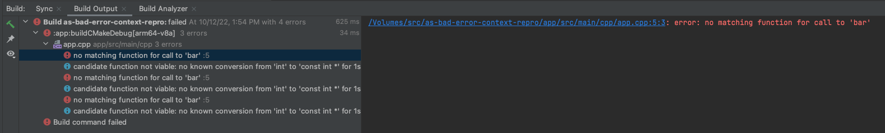
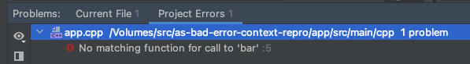

# Android Studio bad error context repro case

This project demonstrates Android Studio's default behavior of hiding useful
error context.

This code has a mistake where a pointer argument is expected, but the caller
forgot `&`. If you open this project in Android Studio and click the build
button, Android Studio will automatically focus on the `error:` line _only_,
without the context `note:` lines. The user sees only:

```
/Volumes/src/as-bad-error-context-repro/app/src/main/cpp/app.cpp:5:3: error: no matching function for call to 'bar'
```



If you click the root of the tree in the build output window (which shows the
unmodified gradle stdout/stderr), you can see the much better error message:

```
  /Users/danalbert/Library/Android/sdk/ndk/25.1.8937393/toolchains/llvm/prebuilt/darwin-x86_64/bin/clang++ --target=x86_64-none-linux-android21 --sysroot=/Users/danalbert/Library/Android/sdk/ndk/25.1.8937393/toolchains/llvm/prebuilt/darwin-x86_64/sysroot -Dapp_EXPORTS  -g -DANDROID -fdata-sections -ffunction-sections -funwind-tables -fstack-protector-strong -no-canonical-prefixes -D_FORTIFY_SOURCE=2 -Wformat -Werror=format-security   -fno-limit-debug-info  -fPIC -Werror=unguarded-availability -MD -MT CMakeFiles/app.dir/app.cpp.o -MF CMakeFiles/app.dir/app.cpp.o.d -o CMakeFiles/app.dir/app.cpp.o -c /Volumes/src/as-bad-error-context-repro/app/src/main/cpp/app.cpp
  /Volumes/src/as-bad-error-context-repro/app/src/main/cpp/app.cpp:5:3: error: no matching function for call to 'bar'
    bar(b);
    ^~~
  /Volumes/src/as-bad-error-context-repro/app/src/main/cpp/app.cpp:1:13: note: candidate function not viable: no known conversion from 'int' to 'const int *' for 1st argument; take the address of the argument with &
  extern void bar(const int*);
              ^
  1 error generated.
```

The note tells the user exactly what mistake they made and how to fix it.

The "Problems" window is no better:



After fixing the coding error (`&b`), building again shows another variant of
this:

```
C/C++: clang++: error: linker command failed with exit code 1 (use -v to see invocation)
```

This error message says nothing at all. If we zoom out to the root again:

```
> Build command failed.
  Error while executing process /Users/danalbert/Library/Android/sdk/cmake/3.22.1/bin/ninja with arguments {-C /Volumes/src/as-bad-error-context-repro/app/.cxx/Debug/1k5b2u6q/x86_64 app}
  ninja: Entering directory `/Volumes/src/as-bad-error-context-repro/app/.cxx/Debug/1k5b2u6q/x86_64'
  [1/1] Linking CXX shared library /Volumes/src/as-bad-error-context-repro/app/build/intermediates/cxx/Debug/1k5b2u6q/obj/x86_64/libapp.so
  FAILED: /Volumes/src/as-bad-error-context-repro/app/build/intermediates/cxx/Debug/1k5b2u6q/obj/x86_64/libapp.so 
  : && /Users/danalbert/Library/Android/sdk/ndk/25.1.8937393/toolchains/llvm/prebuilt/darwin-x86_64/bin/clang++ --target=x86_64-none-linux-android21 --sysroot=/Users/danalbert/Library/Android/sdk/ndk/25.1.8937393/toolchains/llvm/prebuilt/darwin-x86_64/sysroot -fPIC -g -DANDROID -fdata-sections -ffunction-sections -funwind-tables -fstack-protector-strong -no-canonical-prefixes -D_FORTIFY_SOURCE=2 -Wformat -Werror=format-security   -fno-limit-debug-info  -static-libstdc++ -Wl,--build-id=sha1 -Wl,--no-rosegment -Wl,--fatal-warnings -Wl,--gc-sections -Wl,--no-undefined -Qunused-arguments -shared -Wl,-soname,libapp.so -o /Volumes/src/as-bad-error-context-repro/app/build/intermediates/cxx/Debug/1k5b2u6q/obj/x86_64/libapp.so CMakeFiles/app.dir/app.cpp.o  -latomic -lm && :
  ld: error: undefined symbol: bar(int const*)
  >>> referenced by app.cpp:5 (/Volumes/src/as-bad-error-context-repro/app/src/main/cpp/app.cpp:5)
  >>>               CMakeFiles/app.dir/app.cpp.o:(foo())
  clang++: error: linker command failed with exit code 1 (use -v to see invocation)
  ninja: build stopped: subcommand failed.
```

Now we have a lot more information. The build failed because a definition of
`bar` was not found, and we're given a link to the call site. On top of that, we
have the full link command that was used, so we can fairly quickly confirm that
whatever library should have contained the definition of `bar` was not linked,
and that's why the build is broken.

The "problems" window still shows "no matching function for call to 'bar'". It
did not update.

Finally, this is bad for build script errors as well. Edit CMakeLists.txt and replace `app.cpp` with `app.cc`:

```
CMake Error at CMakeLists.txt:4 (add_library):
Cannot find source file:
```

And the full error message:

```
CMake Error at CMakeLists.txt:4 (add_library):
  Cannot find source file:

    app.cc


CMake Error at CMakeLists.txt:4 (add_library):
  No SOURCES given to target: app
```
